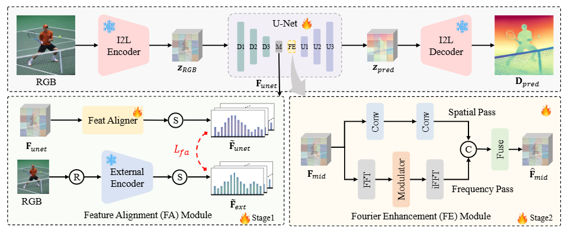

>We present DepthMaster, a tamed single-step diffusion model that customizes generative features in diffusion models to suit the discriminative depth estimation task. We introduce a Feature Alignment module to mitigate overfitting to texture and a Fourier Enhancement module to refine fine-grained details. DepthMaster exhibits state-of-the-art zero-shot performance and superior detail preservation ability, surpassing
other diffusion-based methods across various datasets.

## 📢 News
2025-01-15: Evaluation code is released. <br>
2025-01-02: [Paper](https://arxiv.org/abs/2501.02576) is released on arXiv. <br>

## Installation
Please refer to [installation.md](./docs/installation.md) for installation.

## Checkpoint
The model can be downloaded [here](https://huggingface.co/zysong212/DepthMaster).

## 🏃 Testing on your images

### 📷 Prepare images

Place your images in a directory, for example, under `in_the_wild_example/input`, and run the following inference command.

```bash
bash scripts/infer.sh
